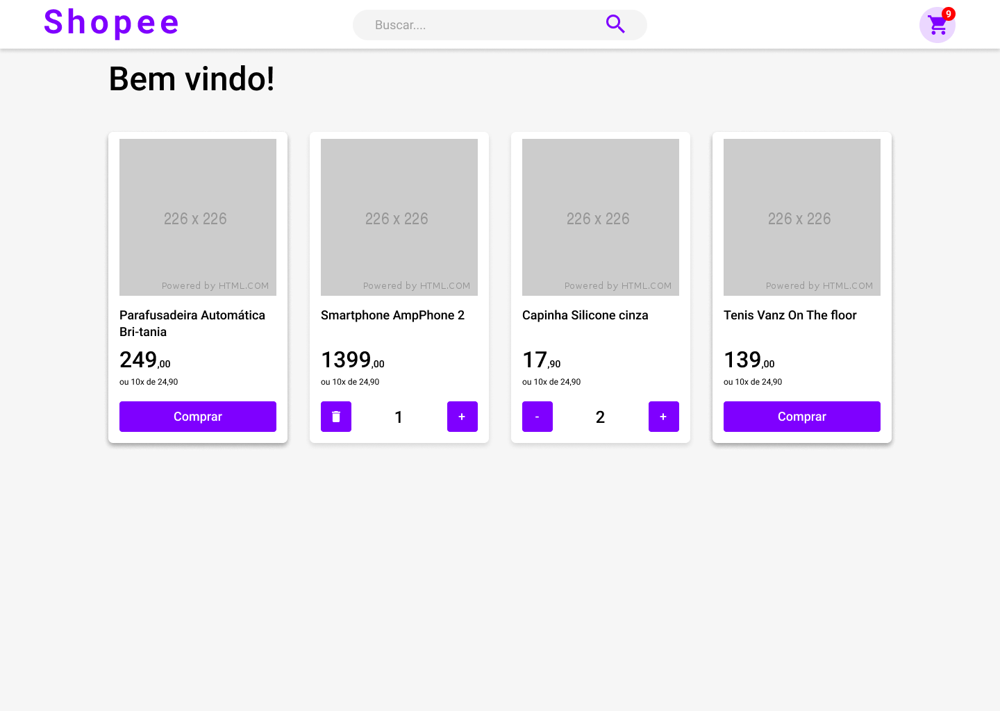

<h1 align="center">
  
</h1>

<p align="center">
  <a href="#page_facing_up-sobre">Sobre</a>&nbsp;&nbsp;&nbsp;|&nbsp;&nbsp;&nbsp;
  <a href="#computer-web">Web</a>&nbsp;&nbsp;&nbsp;|&nbsp;&nbsp;&nbsp;
  <a href="#iphone-mobile">Mobile</a>&nbsp;&nbsp;&nbsp;|&nbsp;&nbsp;&nbsp;
  <a href="#rocket-tecnologias-utilizadas">Tecnologias Utilizadas</a>&nbsp;&nbsp;&nbsp;|&nbsp;&nbsp;&nbsp;
  <a href="#gear-como-configurar-e-executar">Como configurar e executar</a>&nbsp;&nbsp;&nbsp;|&nbsp;&nbsp;&nbsp;
  <a href="#punch-contribuição">Contribuição</a>
</p>

<br/>

<p align="center">
  
  
  
  
  
  
  <a href="https://github.com/mausampaio/shopee/commits/master">
    
  </a>  
</p>

<br/>

<h3 align="center">
  
</h3>

<br/>

## :page_facing_up: Sobre

O Shopee é uma aplicação desenvolvida para a conclusão do módulo de 'front-end' do curso DEVinHouse. Tal projeto analoga com um 'site' de compras, sendo, portanto, uma aplicação de grande verossimilhança. Foi utilizado, em seu desenvolvimento, a biblioteca 'React', 'React Router DOM' e 'Styled Components' (as quais possuem ampla utilização) e a linguagem de programação 'JavaScript'.

<br/>

## :computer: Web

<h3 align="center">
  
</h3>

<br/>

## :iphone: Mobile

<h3 align="center">
  
</h3>

<br/>

## :rocket: Tecnologias Utilizadas

- [ReactJS](https://github.com/facebook/react)

<br/>

## :gear: Como configurar e executar

### Pré-requisitos

```bash

    # Clonar o repositório
    $ git clone https://github.com/mausampaio/shopee.git

    # Navegar para o diretório
    $ cd shopee

```

### Utilizando o Docker

```bash

    $ docker-compose up -d

```

### Sem o Docker

```bash

    $ npm install
    # ou
    $ yarn
    # Para iniciar a aplicação
    $ npm start
    # ou
    $ yarn start

```

<br/>

## :punch: Contribuição

<p> 
  <a href="url"></a>
  <br/>
  Alanderson Santana - [Github](https://github.com/alandersonsds) | [Linkedin](https://linkedin.com/in/alandersonsds)
</p>

<p>
  <a href="url"></a>
  <br/>
  Cristian Ogliari - [Github](https://github.com/cristianogliari) | [Linkedin](https://linkedin.com/in/cristian-ogliari-7070bb111)
</p>

<p>
  <a href="url"></a>
  <br/>
  Michael Nascimento - [Github](https://github.com/mikansc) | [Linkedin](https://linkedin.com/in/michaelnsc)
</p>

<p>
  <a href="url"></a>
  <br/>
  Thiago Mathias Simon - [Github](https://github.com/thiagomathiassimon) | [Linkedin](https://linkedin.com/in/thiago-mathias-simon-4b9b381bb)
</p>

---

<h4 align="center">
  Feito com :purple_heart: by <a href="https://www.linkedin.com/in/mausampaio/" target="_blank">Maurício Sampaio</a>.
</h4>
